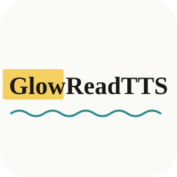

  

# GlowReadTTS

A Chrome extension that reads selected webpage text and pasted/typed text aloud using bundled on-device AI voices. Fully offline-capable, with no accounts, API keys, or data collection.

**New to GlowReadTTS?** Read the [Getting Started guide](GETTING_STARTED.md) for installation, setup, and feature walkthroughs.

### On-Device AI Voices. Highlight as You Read.

---

## Demo

https://github.com/user-attachments/assets/3907923e-1b0b-4ef5-92be-14e9553f21ec

---

## Features

- **AI Voices** - 15 bundled on-device neural voices (American and British English). ~96MB of model weights ship with the extension; no API keys, no downloads, no network calls.
- **Text Input** - Paste or type any text and hear it read aloud
- **Right-Click Reading** - Select text on any webpage, right-click, choose "Read with GlowReadTTS" - with highlight-as-you-read on the page
- **On-Page Stop Button** - A floating Stop button appears top-right of the page during right-click reads, so you can halt without opening the popup
- **Speed Control** - Adjust reading speed from 0.25x to 2x
- **Performance Toggle** - Optional selection-driven pre-warm so the first right-click read of a session starts in ~1–2 s (default ON; switch off in Settings to keep idle RAM minimal)
- **Privacy First** - 100% local processing. No data collection, no analytics, no accounts, no network calls.
- **Offline Mode** - Works fully offline (the AI model is bundled in the extension package)

## Installation

### From the Chrome Web Store

**[Install GlowReadTTS](https://chromewebstore.google.com/detail/glowreadtts-text-to-speec/jaofbfniifmoffcehkgjlafeiefppnhg)** - free, no account required.

The download is around 132 MB, because the neural voice model ships inside the extension package instead of being fetched on first use. It is a one-time cost: nothing is downloaded afterwards, and the extension works with no network connection at all.

### From Source (Developer Mode)

1. Clone or download this repository
2. Open `chrome://extensions` in Chrome
3. Enable "Developer mode" (top right toggle)
4. Click "Load unpacked"
5. Select the repository folder
6. Click the GlowReadTTS icon in your toolbar to start

## Usage

1. **Type or paste text** into the text box and click "Read Text"
2. **Right-click** selected text on any page → "Read with GlowReadTTS" (the spoken sentence is highlighted on the page)

## AI Voices

GlowReadTTS uses AI-powered voices that run entirely on your device. These voices:

- Sound significantly more natural than typical OS speech engines
- Are bundled with the extension (~96MB) - no runtime download, no network calls
- Require no API keys, accounts, or ongoing costs
- Support American and British English with 15 curated AI voices
- Stream sentence-by-sentence so audio starts playing within ~1–2 seconds of your click on capable hardware
- Available from the popup and from the right-click context menu

To use: open GlowReadTTS → pick a voice from the dropdown → click play.

## Privacy & Security

- **Zero data collection** - no analytics, no telemetry, no tracking
- **100% local processing** - text never leaves your device
- **No accounts** - no sign-up, no API keys required
- **Open source** - full transparency, inspect the code yourself

## Tech Stack

- Vanilla JavaScript (no frameworks, no build step)
- Chrome Extension Manifest V3
- [Kokoro-82M](https://huggingface.co/hexgrad/Kokoro-82M) neural TTS model, bundled as ONNX
- ONNX Runtime Web (WebAssembly) for on-device inference

For the full list of third-party libraries and their licenses, see [NOTICE](NOTICE).

## License & Policies

- **Changes:** [CHANGELOG.md](CHANGELOG.md)
- **License:** Apache License 2.0 - see [LICENSE](LICENSE) and [NOTICE](NOTICE).
- **Privacy Policy:** [PRIVACY.md](PRIVACY.md)
- **Terms of Use (EULA):** [EULA.md](EULA.md)
